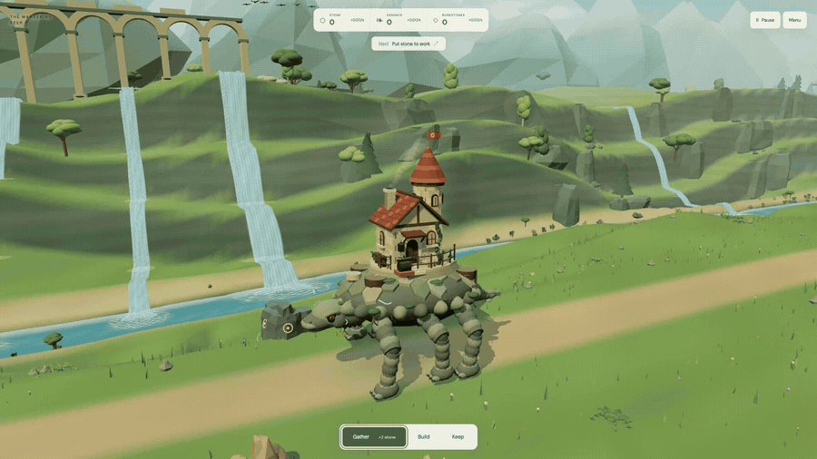
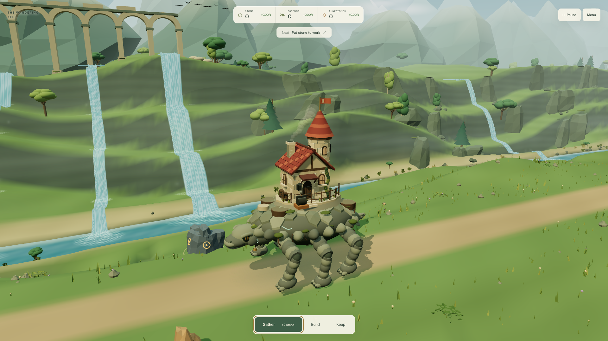
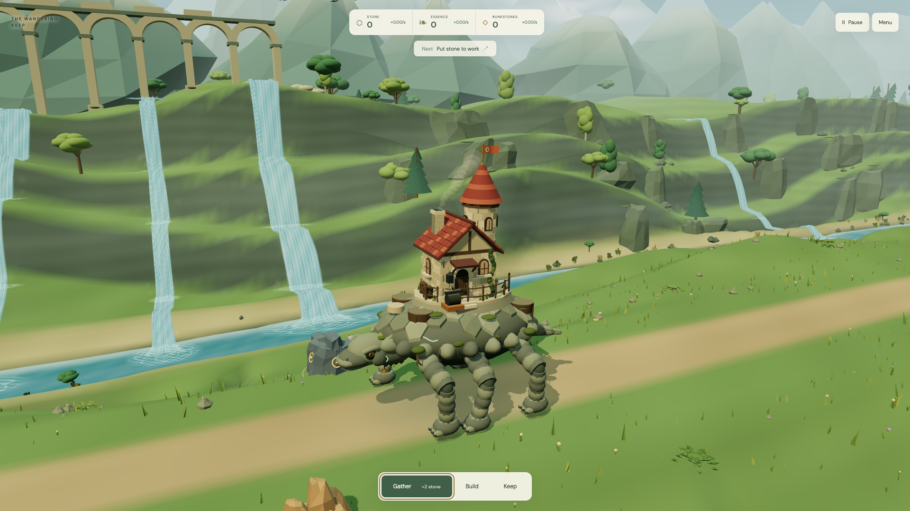

# The Wandering Keep



Grow a castle on the back of Morrow, a six-legged stone guardian with a long road ahead.

**[▶ Play in browser](https://kpetrovski.me/play/the-wandering-keep/)**





## How to play

- Gather stone from marked outcrops with a click, the Gather button, or **E**.
- Open **Build**, choose a building, then a glowing pad. Quarries produce stone; gardens produce essence; forges make runestones.
- Upgrade the Keep, unfold its wings, and work toward the Crown Beacon.
- **Drag** to orbit, **scroll** to zoom, **R** to reset the camera, **Space** to pause. **H** hides the UI; **V** opens scenic view; **C** brings you closer to Morrow.

Progress saves in your browser. This is a single-player first chapter; there is no offline production.

## Development

TypeScript, Three.js, Vite.

```sh
npm install
npm run dev
```

[Development, verification, and deployment notes](DEVELOPMENT.md).
